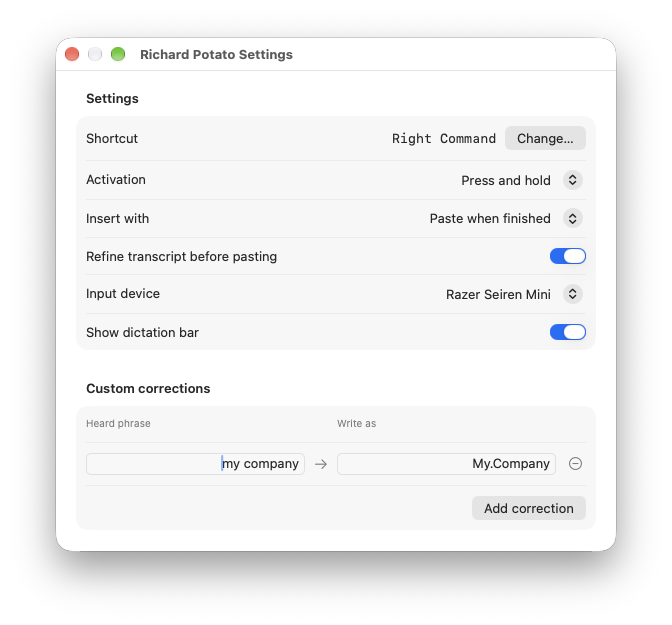
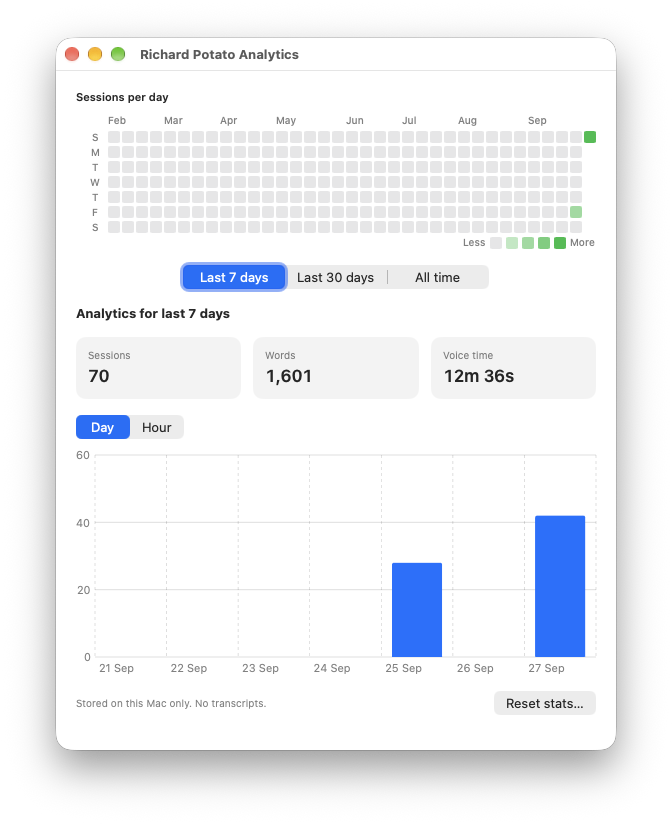

# Richard Potato

Richard Potato is a native macOS application that you use for dictation. It uses Apple's on-device speech model, and so makes no network requests, no language model downloads, and no subscription fees.

---

The native macOS dictation feature works, but suffers slow cold-start times and lacks some basic quality of life features. Richard Potato keeps the dictation model warm, meaning you get instant start for dictation.

Richard Potato supports

- Instant on-device dictation
- Insert as you speak, or wait until you're done
- Can leverage on-device Apple AI model to clean up transcriptions before inserting
- Privacy-focussed analytics, for the stats nerds

## Screenshots

**Dictation bar**


**Settings**



**Analytics**



## Build and run

Requires macOS 26 or later and Xcode 27 or later.

Run `./scripts/setup-signing.sh` once to create a local code-signing certificate in your login keychain. This step changes the keychain and may ask for your password. Builds stop if the certificate is missing.

```bash
./scripts/dev.sh      # Build and open the app
./scripts/release.sh  # Build an app and zip in dist/
```

To publish a release, commit and push your changes, then run `./scripts/github-release.sh`. It asks for release notes and uploads the zip to a GitHub release tagged with the project version.

The build scheme signs Debug and Release apps with the same certificate so macOS can retain their permission grants. A release from this local certificate is not Apple notarized. Recipients may need to right-click the app and select **Open** on first use.

## Use

Grant Microphone and Accessibility access on first use. Use the menu bar icon to open Settings or Analytics. Settings lets you change the shortcut, activation mode, input device, and dictation bar. You can paste finished text or type it while you speak. Paste mode can also show an original and a refined transcript. Custom corrections replace phrases you specify.

The app prepares the speech model at launch. It opens the microphone when dictation starts and closes it when dictation ends. Analytics saves session times, durations, and word counts locally. It does not save audio or transcript text.

## License

This project is released under [The Unlicense](UNLICENSE).
