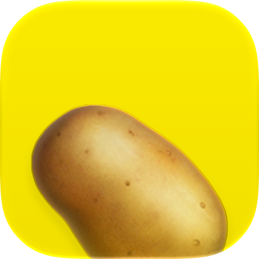

# Richard Potato

Richard Potato is a macOS menu bar app for dictation into the active app. It uses Apple's on-device speech model. It makes no app network requests. The speech model may need a download during setup.

## Build and run

Requires macOS 26 or later and Xcode 27 or later.

Run `./scripts/setup-signing.sh` once to create a local code-signing certificate in your login keychain. This step changes the keychain and may ask for your password. Builds stop if the certificate is missing.

```bash
./scripts/dev.sh      # Build and open the app
./scripts/release.sh  # Build an app and zip in dist/
```

The build scheme signs Debug and Release apps with the same certificate so macOS can retain their permission grants. A release from this local certificate is not Apple notarized. Recipients may need to right-click the app and select **Open** on first use.

## Use

Grant Microphone and Accessibility access on first use. Use the menu bar icon to open Settings or Analytics. Settings lets you change the shortcut, activation mode, input device, and dictation bar. You can paste finished text or type it while you speak. Paste mode can also show an original and a refined transcript. Custom corrections replace phrases you specify.

The app prepares the speech model at launch. It opens the microphone when dictation starts and closes it when dictation ends. Analytics saves session times, durations, and word counts locally. It does not save audio or transcript text.

## License

This project is released under [The Unlicense](UNLICENSE).
